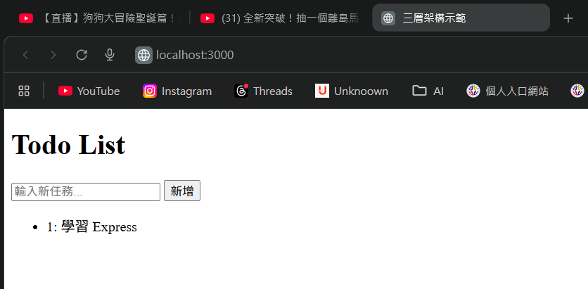

# 第2次作業題目-作業-QZ2
>
>學號：112111119
> 
>姓名：賴俊升
> 
>作業撰寫時間：60 (mins，包含程式撰寫時間)
> 
>最後撰寫文件日期：2025/12/31
>

本份文件包含以下主題：(至少需下面兩項，若是有多者可以自行新增)
- [x] 說明內容
- [x] 個人認為完成作業須具備觀念

## 說明程式與內容

1. HTTP Status Code 有哪些？怎麼分類？

Ans:

HTTP 狀態碼是說「剛才的請求發生了什麼事」的一種三位數代碼。

這些代碼共分為 五大類（1xx 到 5xx）。

1. 1xx：資訊回應
伺服器已收到請求
100 ： 伺服器已收到請求的開頭部分，請客戶端繼續發送剩餘部分。

101 ： 協議切換（例如從 HTTP 切換到 WebSocket 時會看到）。

1. 2xx：成功 (Success)
請求已成功被伺服器接收
200 OK： 請求成功

201 Created： 請求成功且建立了一個新的資源

204 No Content： 請求成功但伺服器不回傳任何內容

1. 3xx：重新導向 (Redirection)
資源已經沒了，瀏覽器需要採取進一步動作（通常會自動跳轉）才能完成請求。

301 Moved Permanently： 網址永久變更，會轉移到新網址。

302 Found (Moved Temporarily)：  網址暫時變更，未來可能會改回來。

304 Not Modified： 未修改（快取）。 資源自上次請求後沒變過，直接讀取瀏覽器的快取即可，不用重新下載。

1. 4xx：客戶端錯誤 (Client Error)
含義： 自己的問題。可能是網址打錯、權限不足或格式錯誤。

400 Bad Request： 請求語法錯誤，伺服器看不懂。

401 Unauthorized： 未授權。

403 Forbidden： 禁止訪問。 即使你登入了，你也沒權限看這個頁面

404 Not Found： 找不到網頁。 你請求的資源不存在

405 Method Not Allowed： 方法不被允許。例如此接口只接受 POST，你卻用了 GET。

429 Too Many Requests： 請求次數過多。你點擊太快或發送太多請求，被伺服器暫時擋下來。

1. 5xx：伺服器錯誤 (Server Error)
含義： 問題在 「伺服器（網站端）。

500 Internal Server Error： 內部伺服器錯誤。 

502 Bad Gateway： 作為網關或代理的伺服器，從上游伺服器收到無效回應

503 Service Unavailable： 伺服器過載或正在維護中，暫時無法處理請求。

504 Gateway Timeout： 網關超時。上游伺服器回應太慢。

1. 在 Express 中，設計基本上可以分成幾層？請依上述回答實作一個後端與前端的網站(需有程式碼)，並且將結果和執行畫面顯示於該份md，並逐步說明。

Ans:

三層架構說明
我們通常由外而內將程式分為這三層：

控制層
負責第一線面對客戶（瀏覽器）。

當接收 HTTP 請求 (req)、解析參數、呼叫下一層處理業務，最後決定回傳什麼狀態碼 (200 OK, 400 Bad Request) 與資料 (res)。

服務層 
處理所有的邏輯。

這是程式最純粹的地方。它接收資料，進行運算、判斷

資料存取層

專門負責跟資料庫（Database）溝通。

執行 SQL 語句或 MongoDB 指令（如 find, insert）。